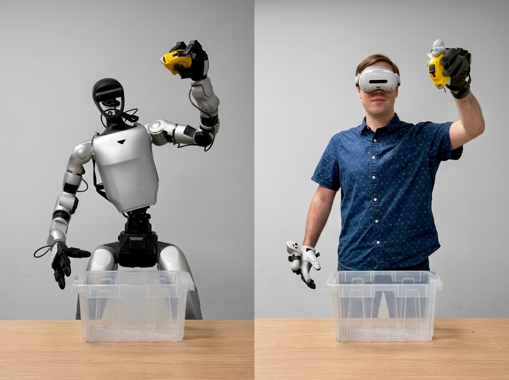

<!--
SPDX-FileCopyrightText: Copyright (c) 2025-2026 NVIDIA CORPORATION & AFFILIATES. All rights reserved.
SPDX-License-Identifier: Apache-2.0
-->

# Isaac Teleop

**The unified framework for high-fidelity ego-centric and robotics data collection.**

---

## Overview

**Isaac Teleop**: The unified standard for high-fidelity egocentric and robot data collection.
It is designed to address the data bottleneck in robot learning by streamlining device integration;
standardizing high-fidelity human demo data collection; and foster device & data interoperability.

## Key Features

- Unified stack for sim & real teleoperation
- Standardized device interface
- Flexible retargeting framework

See the [Ecosystem](https://nvidia.github.io/IsaacTeleop/main/overview/ecosystem.html) page for supported robotics stacks, devices, and retargeting details.

### Teleoperation Use Cases

- Currently supported use cases
  - Use XR headsets for gripper / tri-finger hand manipulation
  - Use XR headsets with gloves for dex-hand manipulation
  - Seated full body loco-manipulation (Homie)
  - Tracking based full body loco-manipulation (Sonic)
- Upcoming use cases
  - Egocentric data collection (aka “no-robot”)
  - Teleoperate using only non-XR devices (e.g. gamepad, Gello, haply, etc.)
  - Teleoperate cloud based robotics simulations
  - Remote teleoperation with camera streaming to the desktop
  - Remote teleoperation with immersive camera streaming to XR headsets

## Quick Start

### Documentation

Our [documentation page](https://nvidia.github.io/IsaacTeleop) provides everything you need to get started, including detailed tutorials and step-by-step guides. Follow these links to learn more:

- [Architecture](https://nvidia.github.io/IsaacTeleop/main/overview/architecture.html)
- [Quick installation steps](https://nvidia.github.io/IsaacTeleop/main/getting_started/quick_start.html)
- [How to build from source](https://nvidia.github.io/IsaacTeleop/main/getting_started/build_from_source.html)

### Install & Run Isaac Lab

Isaac Tepeop Core is design to work side by side with [NVIDIA Isaac Lab](https://github.com/isaac-sim/IsaacLab) starting with Isaac Lab 3.0 EA release.

To get started, please refer to Isaac Lab's [Installation](https://isaac-sim.github.io/IsaacLab/main/source/setup/installation/index.html) guide for more details. Then follow the [CloudXR teleoperation in Isaac Lab](https://isaac-sim.github.io/IsaacLab/main/source/how-to/cloudxr_teleoperation.html) to get started with Teleoperation in Sim.
